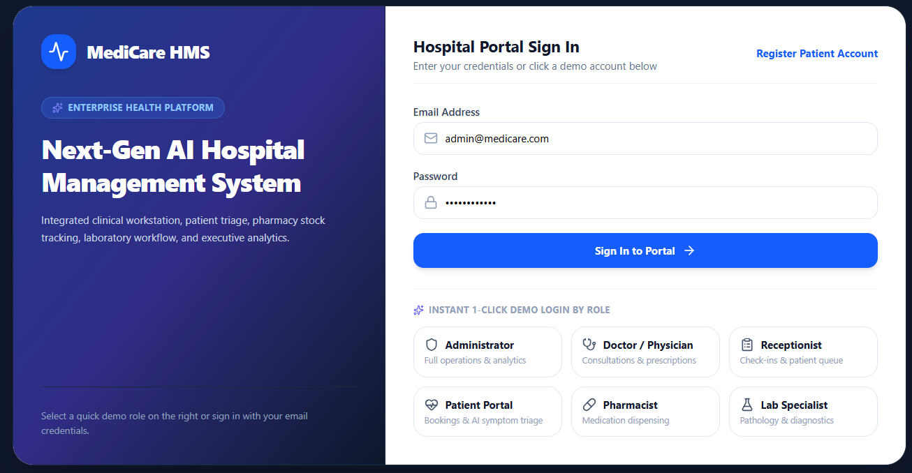
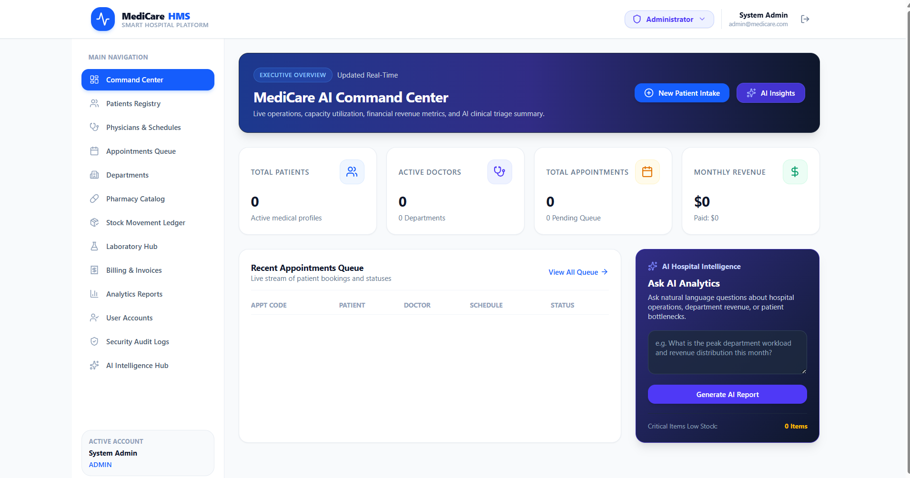
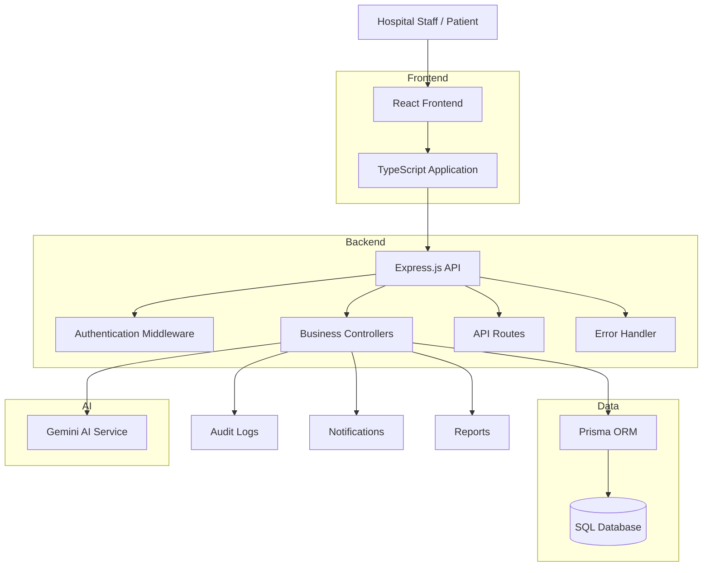

# 🏥 MediCareAI

## AI-Powered Hospital Management System

<p align="center">

A modern full-stack Hospital Management System designed to digitize hospital operations, patient care workflows, appointments, medical records, billing, inventory, laboratory operations, and AI-assisted healthcare services.

</p>

<p align="center">


</p>

<p align="center">


</p>

---

# 🚀 Overview

**MediCareAI** is a full-stack Hospital Management System built with React, TypeScript, Node.js, Express, Prisma, and AI services.

The platform brings multiple hospital workflows together into a centralized web application.

It includes role-based dashboards and modules for administrators, doctors, patients, pharmacists, receptionists, and laboratory staff.

The system is designed to provide a structured foundation for managing hospital operations while also introducing AI-assisted healthcare functionality.

---

# 🖥️ Dashboard Preview

<p align="center">
  
</p>

<p align="center">
  
</p>

---

# ✨ Key Features

## 🔐 Authentication & Access

- User registration
- Secure login
- JWT-based authentication
- Refresh token support
- Protected API routes
- Role-based application access

## 👨‍⚕️ Doctor Management

- Doctor profiles
- Doctor departments
- Doctor dashboard
- Appointment management
- Medical record access
- Prescription workflows

## 🧑‍🤝‍🧑 Patient Management

- Patient registration
- Patient profiles
- Patient dashboard
- Medical information
- Appointment history
- Prescription information
- Medical records

## 📅 Appointment Management

- Appointment creation
- Appointment scheduling
- Appointment status management
- Doctor and patient association
- Receptionist appointment workflow

## 📋 Medical Records

- Patient medical records
- Medical history
- Record management
- Doctor access to patient information

## 💊 Pharmacy & Medicine

- Medicine management
- Inventory management
- Pharmacist dashboard
- Prescription-related workflows
- Medicine stock monitoring

## 🧪 Laboratory

- Laboratory dashboard
- Lab operations
- Lab records
- Patient-related laboratory workflows

## 💳 Billing

- Billing management
- Billing records
- Patient billing workflows
- Billing dashboard

## 📊 Reports & Analytics

- Hospital reports
- Dashboard statistics
- Operational information
- Audit logs
- Data visualization

## 🤖 AI Assistance

- AI assistant interface
- Gemini AI integration
- AI service layer
- AI-assisted healthcare workflows

> AI features are intended as software assistance and should not replace professional medical judgment.

## 🔔 Notifications

- Notification management
- User-specific notifications
- Hospital workflow notifications

## 🛡️ Audit & Security

- Audit logs
- Authentication middleware
- Error handling middleware
- Helmet security headers
- Rate limiting
- Input validation
- Environment-based configuration

---

# 👥 User Roles

MediCareAI includes role-specific application areas for:

| Role | Main Responsibilities |
|---|---|
| Admin | Manage hospital system, users, departments, doctors, patients, reports, inventory and audits |
| Doctor | Manage appointments, patients, medical records and prescriptions |
| Patient | View personal healthcare information and appointments |
| Pharmacist | Manage medicines, inventory and pharmacy workflows |
| Receptionist | Manage patient and appointment workflows |
| Lab Staff | Manage laboratory operations and records |

---

# 🏗️ System Architecture



---

# 🔄 Application Flow

```text
User
  ↓
React + TypeScript Frontend
  ↓
Express.js REST API
  ↓
Authentication / Authorization
  ↓
Controllers
  ↓
Prisma ORM
  ↓
SQL Database
```

AI-assisted workflow:

```text
User Request
     ↓
React AI Assistant
     ↓
Express API
     ↓
Gemini AI Service
     ↓
AI Response
     ↓
React Interface
```

---

# 🛠️ Technology Stack

## Frontend

| Technology | Purpose |
|---|---|
| React 19 | User Interface |
| TypeScript | Type-safe application development |
| Vite | Development and build tool |
| Tailwind CSS | UI styling |
| Lucide React | Icons |
| Chart.js | Data visualization |
| React Chart.js 2 | React chart integration |
| Motion | UI animations |

## Backend

| Technology | Purpose |
|---|---|
| Node.js | Backend runtime |
| Express.js | REST API framework |
| TypeScript | Backend development |
| JWT | Authentication |
| bcryptjs | Password hashing |
| Helmet | HTTP security headers |
| express-rate-limit | API rate limiting |
| Zod | Input validation |
| CORS | Cross-origin API access |

## Database

| Technology | Purpose |
|---|---|
| Prisma | ORM |
| SQL Database | Persistent data storage |
| Prisma Client | Database access |

## AI

| Technology | Purpose |
|---|---|
| Google Gemini | AI-assisted functionality |
| Google GenAI SDK | Gemini API integration |

---

# 📁 Project Structure

```text
MediCareAI/
│
├── assets/
│   ├── dashboard1.png
│   └── dashboard2.png
│
├── prisma/
│   └── schema.prisma
│
├── src/
│   │
│   ├── backend/
│   │   ├── config/
│   │   │   └── db.ts
│   │   │
│   │   ├── controllers/
│   │   │   ├── aiController.ts
│   │   │   ├── appointmentController.ts
│   │   │   ├── auditController.ts
│   │   │   ├── authController.ts
│   │   │   ├── billingController.ts
│   │   │   ├── departmentController.ts
│   │   │   ├── doctorController.ts
│   │   │   ├── inventoryController.ts
│   │   │   ├── labController.ts
│   │   │   ├── medicalRecordController.ts
│   │   │   ├── medicineController.ts
│   │   │   ├── notificationController.ts
│   │   │   ├── patientController.ts
│   │   │   ├── prescriptionController.ts
│   │   │   ├── reportController.ts
│   │   │   └── userController.ts
│   │   │
│   │   ├── middleware/
│   │   │   ├── authMiddleware.ts
│   │   │   └── errorHandler.ts
│   │   │
│   │   ├── routes/
│   │   │   ├── aiRoutes.ts
│   │   │   ├── appointmentRoutes.ts
│   │   │   ├── auditRoutes.ts
│   │   │   ├── authRoutes.ts
│   │   │   ├── billingRoutes.ts
│   │   │   ├── departmentRoutes.ts
│   │   │   ├── doctorRoutes.ts
│   │   │   ├── inventoryRoutes.ts
│   │   │   ├── labRoutes.ts
│   │   │   ├── medicalRecordRoutes.ts
│   │   │   ├── medicineRoutes.ts
│   │   │   ├── notificationRoutes.ts
│   │   │   ├── patientRoutes.ts
│   │   │   ├── prescriptionRoutes.ts
│   │   │   ├── reportRoutes.ts
│   │   │   └── userRoutes.ts
│   │   │
│   │   ├── services/
│   │   │   └── geminiService.ts
│   │   │
│   │   └── prisma/
│   │       └── seed.ts
│   │
│   ├── components/
│   │   ├── layout/
│   │   └── ui/
│   │
│   ├── context/
│   │   └── AuthContext.tsx
│   │
│   ├── pages/
│   │   ├── admin/
│   │   ├── auth/
│   │   ├── doctor/
│   │   ├── lab/
│   │   ├── patient/
│   │   └── pharmacist/
│   │
│   ├── services/
│   │   └── api.ts
│   │
│   └── types/
│       └── index.ts
│
├── .env.example
├── .gitignore
├── index.html
├── package.json
├── prisma.config.ts
├── server.ts
├── tsconfig.json
├── vite.config.ts
└── README.md
```

---

# 🗄️ Database

The project uses **Prisma ORM** for database access.

The Prisma schema is located at:

```text
prisma/schema.prisma
```

The application includes database models supporting hospital workflows such as:

- Users
- Patients
- Doctors
- Departments
- Appointments
- Medical Records
- Prescriptions
- Medicines
- Inventory
- Laboratory operations
- Billing
- Notifications
- Reports
- Audit information

---

# ⚙️ Getting Started

## Prerequisites

Install the following:

- Node.js
- npm
- Git
- A database supported by the configured Prisma datasource
- Gemini API access if AI functionality is enabled

---

# 📥 Clone the Repository

```bash
git clone https://github.com/Pratikfating123/MediCareAI-Hospital-Management-System.git
```

Enter the project:

```bash
cd MediCareAI-Hospital-Management-System
```

---

# 📦 Install Dependencies

```bash
npm install
```

---

# 🔐 Environment Configuration

Create a `.env` file in the project root.

Use `.env.example` as a template.

Example:

```env
GEMINI_API_KEY="your_gemini_api_key"
APP_URL="http://localhost:3000"

JWT_SECRET="your_secure_jwt_secret"
JWT_REFRESH_SECRET="your_secure_refresh_secret"

DATABASE_URL="your_database_url"
```

Never commit the real `.env` file to GitHub.

---

# 🗃️ Prisma Setup

Generate the Prisma client:

```bash
npx prisma generate
```

Push the schema to the configured database:

```bash
npm run db:push
```

If your development workflow uses Prisma migrations, use the appropriate migration command for your configured datasource.

---

# 🌱 Seed Development Data

The project provides a Prisma seed script.

Run:

```bash
npm run db:seed
```

---

# ▶️ Run the Application

Start the development server:

```bash
npm run dev
```

Open the local URL displayed in the terminal.

---

# 🏥 Main Application Modules

## Admin Dashboard

Provides centralized administration for:

- Users
- Doctors
- Patients
- Departments
- Appointments
- Medicines
- Inventory
- Laboratory
- Billing
- Reports
- Audit Logs
- AI Assistant

## Doctor Dashboard

Provides access to:

- Appointments
- Patients
- Medical records
- Prescriptions
- Doctor information

## Patient Dashboard

Provides access to:

- Personal information
- Appointments
- Healthcare information
- Prescriptions
- Medical records

## Pharmacist Dashboard

Provides access to:

- Medicines
- Inventory
- Pharmacy workflows
- Prescription-related information

## Receptionist Dashboard

Provides access to:

- Patient workflows
- Appointment workflows
- Reception operations

## Laboratory Dashboard

Provides access to:

- Laboratory workflows
- Lab records
- Patient-related lab information

---

# 🤖 AI Integration

MediCareAI includes an AI service layer using the Google Gemini ecosystem.

The AI integration is implemented through:

```text
src/backend/services/geminiService.ts
```

The AI controller is located at:

```text
src/backend/controllers/aiController.ts
```

AI routes are located at:

```text
src/backend/routes/aiRoutes.ts
```

AI functionality is designed to assist application workflows.

It should not be treated as a replacement for qualified healthcare professionals or clinical decision-making.

---

# 🔒 Security

The application includes several security-related components:

- JWT authentication
- Password hashing with bcryptjs
- Authentication middleware
- Protected routes
- Helmet security headers
- API rate limiting
- Input validation
- CORS configuration
- Environment-based secrets
- Error handling
- Audit logging

Sensitive files such as `.env` should never be committed.

---

# 📸 Screenshots

The repository currently includes dashboard screenshots:

### Dashboard 1


### Dashboard 2


Additional screenshots can be added later for:

- Patient Management
- Doctor Management
- Appointment Management
- Pharmacy
- Laboratory
- Billing
- AI Assistant
- Reports

---

# 🧪 Development Commands

### Start development server

```bash
npm run dev
```

### Build application

```bash
npm run build
```

### Start production build

```bash
npm start
```

### Type checking

```bash
npm run lint
```

### Push Prisma schema

```bash
npm run db:push
```

### Seed database

```bash
npm run db:seed
```

---

# 📌 Project Highlights

```text
Hospital Management
        ↓
React + TypeScript
        ↓
Node.js + Express
        ↓
Authentication & Authorization
        ↓
Prisma ORM
        ↓
Database
        ↓
Hospital Operations
        ↓
AI Integration
        ↓
Reports & Analytics
```

---

# 🎯 Project Goals

MediCareAI aims to:

- Reduce manual hospital administration
- Centralize hospital information
- Improve patient data organization
- Simplify appointment management
- Support hospital staff workflows
- Provide structured medical record management
- Improve inventory and medicine management
- Introduce AI-assisted healthcare functionality
- Provide a scalable foundation for future hospital services

---

# 🚀 Future Improvements

Potential future enhancements include:

- 🩺 Advanced AI medical assistance
- 💊 Digital prescription generation
- 📱 Mobile application
- 🔔 Email and SMS notifications
- 💳 Online payment integration
- 📈 Advanced hospital analytics
- 🧠 AI-powered health insights
- 🏥 Multi-hospital support
- 👨‍💼 Advanced staff and role management
- 📄 Automated medical reports
- 🔐 Advanced security and access controls
- ☁️ Cloud deployment
- 🐳 Docker support
- 🧪 Automated testing
- 🔄 CI/CD pipeline

---

# 📚 Learning Outcomes

This project demonstrates practical experience with:

- Full-stack application development
- React
- TypeScript
- Node.js
- Express.js
- REST APIs
- Prisma ORM
- Database design
- JWT authentication
- Role-based application workflows
- API security
- AI integration
- Data visualization
- Hospital management workflows
- Git and GitHub

---

# 👨‍💻 Developer

## Pratik Fating

**MCA Student | Cybersecurity Enthusiast | Full-Stack Developer**

### Areas of Interest

- Full-Stack Development
- Cybersecurity
- Artificial Intelligence
- Networking
- Healthcare Technology
- Database Systems

### GitHub

https://github.com/Pratikfating123

---

# ⭐ Support

If you find this project useful or interesting, consider giving the repository a ⭐ on GitHub.

---

<p align="center">

Built with ❤️ using React, TypeScript, Node.js, Express, Prisma, and AI.

</p>
